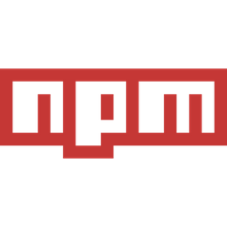

# Hi there 👋, I'm 0xNordian (Néstor Torres)

I'm a Junior Developer passionate about front-end and back-end technologies, aiming to delve into AI and blockchain in the future.

## About Me 📖

-   🌱 I’m currently learning **Next.js**, **SpringBoot**, and **TypeScript**.
-   👯 I’m looking to collaborate on **open source projects** and **innovative web applications**.
-   🤔 I’m seeking help with **clean, scalable code** and **advanced JavaScript concepts**.
-   💬 Ask me about **React**, **Vue**, and **web development best practices**.
-   📫 How to reach me: [management@deverso.io](mailto:management@deverso.io)

## My Skill Set 💻

<!-- <table><tr><td valign="top" width="33%"> -->

### Frontend

  <table>
    <tr>
          <td align="center">
         
        HTML
      </td>
            <td align="center">
         
        CSS
      </td>
            <td align="center">
         
        JavaScript
      </td>
      <td align="center">
         
        TypeScript
      </td>
            <td align="center">
         
        React
      </td>
      <td align="center">
         
        Vue.js
      </td>
      <td align="center">
         
        Next.js
      </td>
            <td align="center">
         
        Redux
      </td>
                  <td align="center">
         
        Pinia
      </td>
                        <td align="center">
         
        Vitest
      </td>
                              <td align="center">
         
        Tailwind
      </td>
      <!-- Add other cells for more icons here -->
    </tr>
    <!-- Add more rows here if needed -->
  </table>

</td><td valign="top" width="33%">

### Backend

  
  <table>
    <tr>
          <td align="center">
         
        Java
      </td>
            <td align="center">
         
        Spring Boot
      </td>
                  <td align="center">
         
        MySQL
      </td>
  </table>

### DevOps

  
  <table>
    <tr>
          <td align="center">
         
        Git
      </td>
            <td align="center">
         
        Github
      </td>
                  <td align="center">
         
        Gitlab
      </td>
                        <td align="center">
         
        Netlify
      </td>
                              <td align="center">
         
        Vercel
      </td>
                                    <td align="center">
         
        npm
      </td>
                                          <td align="center">
         
        bun
      </td>
                                                <td align="center">
         
        Sonarcloud
      </td>
                                                      <td align="center">
         
        NodeJs
      </td>
                                                            <td align="center">
         
        Jira
      </td>
  </table>

## Project Gallery 🌟

<table>
  <tr>
    <!-- Project 1 -->
    <td width="33%" valign="top" style="height: 300px;">
  

    <h5 style="margin: 0; line-height: 25px;">StarWars Starships (React)</h5>
  

  

    
  

  

    <a style="text-decoration: none;" href="https://github.com/0xNordian/sprint8">Repository</a> | 
    <a href="https://sw-sprint8.vercel.app/">Live Demo</a>
  

</td>
    <!-- Project 2 -->
<td width="33%" valign="top" style="height: 300px;">
  

    <h5 style="margin: 0; line-height: 25px;">Jump2Digital Hackathon (React)</h5>
  

  

    
  

  

      <a href="https://github.com/0xNordian/rickyandmorty-j2d-hackaton">Repository</a> | 
      <a href="https://wubba.netlify.app/">Live Demo</a>
  

    <!-- Project 3 -->
    <td width="33%" valign="top" style="height: 300px;">
  

    <h5 align="center" style="margin: 0; line-height: 25px;">Anomalie Web App (Next.js)</h5>
  

  

  

  

      <a href="https://github.com/0xNordian/anomalie-app-supabase">Repository</a> | 
      <a href="https://anomalie.vercel.app/">Live Demo</a>
  

  </tr>
      <tr>
    <!-- Project 4 -->
    <td width="33%" valign="top" style="height: 300px;">
  

    <h5 align="center" style="margin: 0; line-height: 25px;">Cercle Web (Vue)</h5>
  

  

    
  

  

    <a href="https://github.com/0xNordian/IronHack-MidTerm-Rpoject-Circle">Repository</a> | 
    <a href="https://circl3.netlify.app/">Live Demo</a>
  

</td>
    <!-- Project 5 -->
<td width="33%" valign="top" style="height: 300px;">
  

    <h5 align="center" style="margin: 0; line-height: 25px;">Doyt App (Vue)</h5>
  

  

    
  

  

      <a href="https://github.com/0xNordian/you-do">Repository</a> | 
      <a href="https://doyt.netlify.app/">Live Demo</a>
  

    <!-- Project 6 -->
    <td width="33%" valign="top" style="height: 300px;">
  

    <h5 align="center" style="margin: 0; line-height: 25px;">Anomalie Web App</h5>
  

  

  

  

      <a href="https://github.com/0xNordian/React-ExpenseTracker">Repository</a> | 
      <a href="https://trakex.netlify.app/">Live Demo</a>
  

  </tr>

  <!-- Add more rows for additional projects -->
</table>

## Connect with Me 🌐

-   LinkedIn: [/torres-nestor](https://www.linkedin.com/in/torres-nestor/)
-   Twitter: [@0xnordian](https://twitter.com/0xnordian)
-   My Startup Project: [deverso.io](https://deverso.io)

---

Last updated by [oxNordian](https://github.com/0xNordian) on `13/11/2023`.

<!--  -->

<!-- 

 -->

<!--  -->
